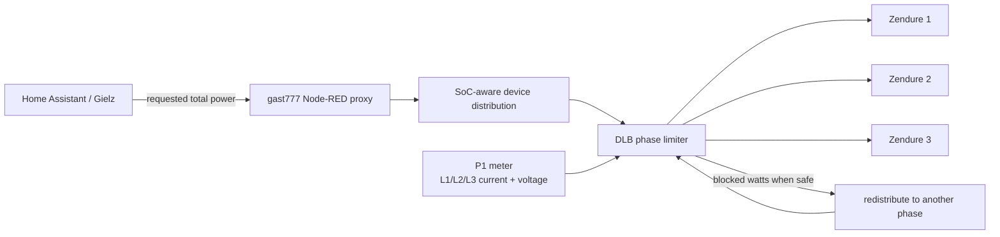

<p align="center">
  
</p>

<p align="center">
  <a href="https://github.com/gast777/Zendure-zenSDK-proxy"></a>
  <a href="https://github.com/Gielz1986/Zendure-HA-zenSDK"></a>
  
  
</p>

# Zendure zenSDK Proxy — Dynamic Load Balancing extension

This repository preserves our **Dynamic Load Balancing (DLB)** development on top of **[gast777/Zendure-zenSDK-proxy](https://github.com/gast777/Zendure-zenSDK-proxy)** for use with **[Gielz1986/Zendure-HA-zenSDK](https://github.com/Gielz1986/Zendure-HA-zenSDK)**.

The upstream proxy solves the multi-device problem: Home Assistant talks to one Node-RED proxy, while that proxy controls up to three Zendure devices as one virtual battery system and performs SoC-aware power distribution. Our extension keeps that behavior and adds **per-phase electrical protection** around charging.

> **Credit:** the proxy foundation, multi-Zendure abstraction and SoC distribution are gast777's work. This repository documents and distributes modified non-commercial builds with DLB added on top. See [UPSTREAM.md](UPSTREAM.md), [MODIFICATIONS.md](MODIFICATIONS.md) and [LICENSE](LICENSE).

<p align="center">
  
</p>

## What this project adds

The objective is simple: **continue following the charge request from Gielz/gast777 as closely as possible, without allowing Zendure charging to overload a physical grid phase.**

DLB adds:

- Per-phase current protection for L1, L2 and L3.
- Home Assistant P1 input through Node-RED **Events: state** nodes.
- Per-phase voltage feedback for better W ↔ A calculations, with a conservative fallback voltage.
- Configurable mapping of each Zendure to its real electrical phase.
- Support for two-device systems and multiple Zendures on the same phase.
- One shared phase budget per physical phase, preventing double-counting of available headroom.
- Redistribution of blocked requested watts only toward phases that actually have spare capacity.
- Startup/deploy preflight protection: fresh P1 data is required before unrestricted charging is allowed.
- Stale/missing P1 fail-safe limiting.
- Live P1-triggered throttling instead of waiting for the next Gielz power command.
- Soft and hard current limits.
- Controlled ramp-down and delayed stepped ramp-up.
- Communication-error handling and cooldown behavior.
- Four independent DLB logging switches in v2.6: soft actions, status/configuration, safety warnings and technical debug.

## How the control path works



DLB only adjusts **AC charging `inputLimit`**. The upstream discharge logic is intentionally left unchanged.

---

# Installation

The base proxy installation below is **adapted from gast777's current upstream instructions** and then extended with the extra DLB steps required by this repository. For the authoritative upstream proxy instructions, see [gast777/Zendure-zenSDK-proxy](https://github.com/gast777/Zendure-zenSDK-proxy#instructions).

## Requirements before you start

For the upstream proxy setup, make sure:

- Home Assistant already has the current Gielz ZenSDK setup installed.
- Node-RED is installed and running.
- Each Zendure and the Node-RED host has a stable/fixed IP address.
- The Zendure devices are reachable over the local network and have strong Wi-Fi/network connectivity.
- You keep a backup/export of your currently working Node-RED flow before replacing anything.

For DLB you additionally need **live phase current data for L1/L2/L3** from Home Assistant. Phase voltage sensors are strongly recommended and are supported by the v2.6 flow.

## 1. Import the Node-RED proxy flow

Use the current integrated flow:

```text
code/integrated/current/20260801-NL-DLB-v2.6.json
```

In Node-RED:

1. Open the menu in the upper-right corner.
2. Select **Import**.
3. Import the JSON flow.
4. If Node-RED offers to install missing nodes, install the required dependencies.
5. Do **not** deploy yet until you have reviewed the configuration below.

## 2. Configure the Zendure IP addresses

Open the main configuration node in the imported flow — the same configuration area used by gast777's proxy — and enter the local IP address for each Zendure you actually use.

Leave unused Zendure slots empty.

Example conceptually:

```text
Zendure 1 → 192.168.x.x
Zendure 2 → 192.168.x.x
Zendure 3 → 192.168.x.x
```

The exact addresses must match your own network.

## 3. Configure the physical phase mapping

This is the important DLB addition. Set the phase for each installed Zendure according to the **actual electrical wiring**:

```text
zendure_1_phase = "L1" / "L2" / "L3"
zendure_2_phase = "L1" / "L2" / "L3"
zendure_3_phase = "L1" / "L2" / "L3"
```

Do not assume Zendure 1 = L1 unless that is how it is physically connected.

Later DLB versions also allow more than one Zendure on the same phase. Those devices then share one physical phase budget.

## 4. Connect the P1 phase sensors

The DLB flow was developed with these canonical Home Assistant entity IDs:

```text
sensor.p1_meter_current_phase_1
sensor.p1_meter_current_phase_2
sensor.p1_meter_current_phase_3
sensor.p1_meter_voltage_phase_1
sensor.p1_meter_voltage_phase_2
sensor.p1_meter_voltage_phase_3
```

Configure the six Home Assistant **Events: state** nodes in Node-RED to use your actual entities.

If your names differ, either edit those nodes directly or use the example mapping under:

```text
code/adapters/zendure_dlb_p1_adapter.yaml
```

## 5. Review the DLB limits

The recovered v2.6 defaults are:

| Setting | Default | Function |
|---|---:|---|
| DLB enabled | `1` | Enables phase protection |
| Redistribution | `1` | Uses spare capacity on other phases when possible |
| Hard phase limit | `25 A` | Emergency/main phase limit |
| Soft phase limit | `23 A` | Normal operating target |
| Fail-safe current | `6 A` | Limit when P1 is stale/missing |
| Voltage fallback | `215 V` | Conservative conversion fallback |
| P1 max age | `15 s` | Older data is considered stale |
| Ramp-up wait | `20 s` | Stable headroom needed before restoration |
| Ramp-up step | `250 W` | Restore power gradually |
| Ramp-up interval | `10 s` | Minimum interval between restore steps |
| Soft ramp-down step | `500 W` | Reduction step above soft limit |
| Live minimum change | `50 W` | Suppresses unnecessary small writes |

These are **project defaults, not universal electrical recommendations**. Set them for your own installation and protective devices.

## 6. Special setup when Node-RED runs as a Home Assistant App

Gast777's upstream instructions require the following Node-RED App configuration when Node-RED runs on the same Home Assistant host:

1. Disable **SSL** for the Node-RED App.
2. Show the unused/optional configuration options.
3. Enable `leave_front_door_open`.
4. Save the App configuration.
5. Restart Node-RED.

Then the Gielz **Zendure IP-address** should point to:

```text
localhost:1880/endpoint
```

If Node-RED runs elsewhere on your LAN, use that host's address and port instead, normally in the form:

```text
IP_ADDRESS:1880/endpoint
```

## 7. Point Gielz/Home Assistant at the proxy

On the Gielz Home Assistant dashboard, open the **Settings** tab and change the **Zendure IP-address** from a physical Zendure to the Node-RED proxy endpoint.

Once the endpoint is correct, the Gielz sensors should start receiving data through the proxy.

## 8. Set total charge/discharge capacity in Gielz

In the same Gielz Settings area, set **Max Charge Power** and **Max Discharge Power** for the combined virtual system.

Gast777 gives these examples for equal 2400 W devices:

- 2 devices → up to `4800 W`
- 3 devices → up to `7200 W`

Use the real limits of the hardware you have installed. DLB then applies an additional per-phase safety budget on top of the requested charge power.

## 9. Deploy and verify P1 preflight

Deploy the flow in Node-RED.

Before testing high charge power, confirm that the flow is receiving fresh current values for all three phases. v2.6 intentionally starts conservatively: it will not immediately apply an unrestricted charging request after deploy/restart until fresh P1 data has arrived.

## 10. First commissioning test

A safe sequence is:

1. Start with a modest charge request.
2. Confirm that gast777's normal SoC-aware distribution still behaves correctly.
3. Add a meaningful load to one physical phase.
4. Confirm that DLB reduces Zendure charging on that constrained phase.
5. Confirm that spare requested watts move only to other phases with available headroom.
6. Remove the added load and verify the delayed, stepped restoration.
7. Temporarily make a P1 input unavailable/stale and confirm that fail-safe limiting engages.
8. Reboot/redeploy Node-RED and verify that the startup preflight again waits for fresh P1 values.

Keep the real P1 phase currents visible during these tests.

## Optional: upstream proxy monitoring sensors

Gast777 also provides additional Home Assistant proxy sensors and dashboard snippets for monitoring the individual Zendures behind the virtual proxy. His installation process places the language-matched proxy sensor YAML inside the Gielz package/configuration and then restarts Home Assistant.

Those upstream-only auxiliary files are **not duplicated here unless we modified them**. Get the latest matching Dutch/English monitoring files directly from gast777's repository:

- [gast777/Zendure-zenSDK-proxy](https://github.com/gast777/Zendure-zenSDK-proxy#monitoring)

This avoids this DLB repository carrying stale copies of unrelated upstream files.

---

# Releases in this repository

## Current

```text
code/integrated/current/20260801-NL-DLB-v2.6.json
```

The current file is the `20260801-NL-DLB-v2.6` flow preserved from our final development work. Its internal release notes identify it as based on gast777 proxy release **20260801** with all integrated DLB v2.6 functionality. Before publication, the three private Zendure IP addresses were replaced with harmless example addresses (`192.168.1.101`–`103`); users must enter their own device IPs.

## Known-good rollback

The **v2.5** line was explicitly field-tested and confirmed working during development. Keep it available when commissioning v2.6:

```text
code/integrated/archive/20260801-NL-DLB-v2.5.json
```

## Historical / experimental

- `code/integrated/archive/` — prior integrated DLB development builds.
- `code/standalone-experimental/` — the earlier standalone DLB experiment and adapter test package.
- `code/adapters/` — sensor mapping and adapter-development helpers.

See [docs/CHANGELOG.md](docs/CHANGELOG.md) for the recovered development history.

# Safety model

The DLB controller is an automation-layer limiter, not an electrical protective device.

At a high level:

1. Gielz/gast777 calculates the requested charge distribution.
2. DLB reads the latest current/voltage for L1/L2/L3.
3. Each physical phase gets one shared charging budget.
4. A constrained phase is reduced first.
5. If enabled, blocked watts are redistributed only where measured spare capacity exists.
6. Stale or missing P1 information activates a conservative fail-safe.
7. Power is restored gradually after the restriction clears.

Keep correctly rated wiring, breakers/fuses and all normal electrical protections in place.

# Attribution

This repository is a modified derivative of **gast777/Zendure-zenSDK-proxy**, originally by Casper Rijnders. The full upstream non-commercial license is included unchanged in [LICENSE](LICENSE), and our changes are listed in [MODIFICATIONS.md](MODIFICATIONS.md).

Upstream projects:

- **gast777 — Zendure-zenSDK-proxy:** https://github.com/gast777/Zendure-zenSDK-proxy
- **Gielz1986 — Zendure-HA-zenSDK:** https://github.com/Gielz1986/Zendure-HA-zenSDK

# Disclaimer

This is community-developed automation controlling residential energy equipment. Test changes carefully, watch real phase currents during commissioning, retain a known-good rollback, and never treat software current limiting as a substitute for normal electrical protection.
