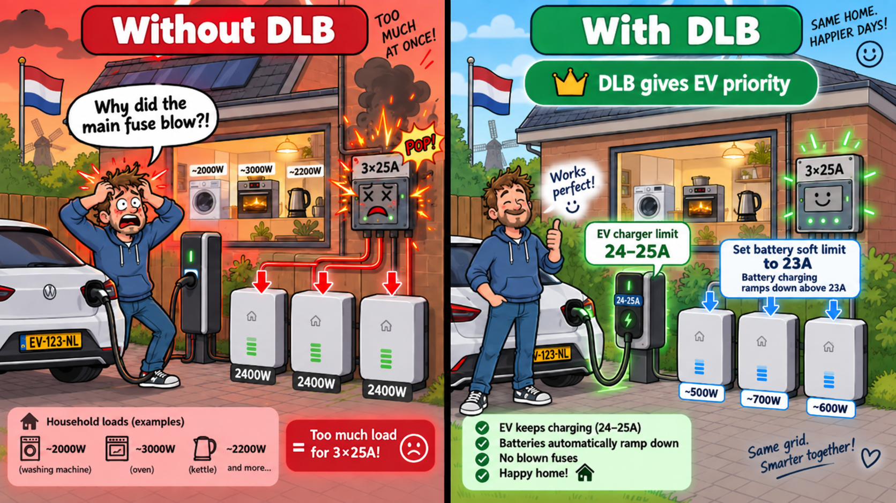

<p align="center">
  
</p>

<p align="center">
  <a href="https://github.com/gast777/Zendure-zenSDK-proxy"></a>
  <a href="https://github.com/Gielz1986/Zendure-HA-zenSDK"></a>
  
  
  
</p>

# Zendure zenSDK Proxy — Dynamic Load Balancing extension

This repository contains our **Dynamic Load Balancing (DLB)** version of **[gast777/Zendure-zenSDK-proxy](https://github.com/gast777/Zendure-zenSDK-proxy)** for use with **[Gielz1986/Zendure-HA-zenSDK](https://github.com/Gielz1986/Zendure-HA-zenSDK)**.

The original gast777 proxy already solves the **multi-Zendure** problem: Home Assistant talks to one Node-RED proxy, while the proxy controls up to three Zendure devices as one larger virtual battery system with SoC-aware distribution. Our work keeps that foundation and adds a protective layer for **AC charging** so the batteries do not overload a real household grid phase.

> **Credit:** the base proxy, API behavior, multi-Zendure abstraction and SoC distribution are gast777’s work. DLB is our extension on top of that foundation. See [UPSTREAM.md](UPSTREAM.md), [MODIFICATIONS.md](MODIFICATIONS.md) and the included upstream [LICENSE](LICENSE).

## Why use DLB?

A common Dutch home has a **3×25A** grid connection.

If you charge **three Zendure batteries** at the same time, each phase can already get a heavy charging load. If an **EV charger** is also active, and normal household devices are running too, the total current on one phase can go too high.

That can blow the **main fuses** from the grid provider.

**That is exactly why we made DLB.**

DLB watches the measured P1 phase currents and automatically reduces Zendure charging when a phase gets too busy.

<p align="center">
  
</p>

## Simple example

Without DLB:

- EV charger is charging
- 3 Zendures are charging
- oven / kettle / washing machine also use power
- one phase can go over **25A**
- main fuse may trip

With DLB:

- EV keeps charging
- Zendure charging ramps down first
- the total phase current stays under control
- the house keeps running normally

## When should you use this?

Use this DLB version if:

- you use **2 or 3 Zendure AC systems** through the gast777 proxy;
- you have a **limited grid connection** such as **3×25A**;
- you want to keep using Gielz/gast777 normally;
- you want the batteries to **back off automatically** when the house or EV charger needs the current.

## Very important: EV chargers with their own load balancing

If your **EV charger already has its own internal load balancing**, that charger and the Zendure DLB are both trying to protect the same grid connection.

That is okay **if you give the EV priority**.

### Easy recommended setup

For a typical **3×25A** Dutch home:

- set **Zendure DLB hard phase limit** to **25A**;
- set **Zendure DLB soft limit** to **23A**;
- set the **EV charger load-balancing limit** to about **24–25A**.

This way:

- the **EV charger wins**;
- Zendure charging starts ramping down earlier;
- the EV keeps charging as intended;
- battery charging gives way before the main fuse is at risk.

### In plain language

Think of it like this:

- **25A** = the real wall / fuse limit
- **23A** = the warning line for the batteries
- when the phase goes above **23A**, DLB tells the Zendures to back off
- if the EV charger wants current, it gets priority

So even if the user is not very technical, the rule is simple:

> **Set the battery DLB a bit lower than the EV charger’s own load-balancing limit.**

## What DLB adds

- Protection for **L1, L2 and L3** independently.
- Physical phase mapping independent of Zendure number.
- One shared safe budget when multiple Zendures are on the same phase.
- Safe redistribution of blocked charging power to other phases with real spare capacity.
- Live P1-triggered corrections during steady charging requests.
- Soft current limit plus hard/emergency limit.
- Controlled ramp-down and delayed stepped ramp-up.
- Startup/deploy preflight: fresh P1 data must be seen after start before unrestricted charging is allowed.
- Stale/missing P1 fail-safe.
- Separate DLB logging categories.

DLB changes **Zendure AC charging `inputLimit` only**. The upstream discharge behavior remains unchanged.

<p align="center">
  
</p>

## Default setup: HomeWizard P1 Dongle

The main DLB flow is meant to work **out of the box** with a **HomeWizard P1 Dongle / HomeWizard Wi-Fi P1 Meter** in Home Assistant.

It expects these entities:

```text
sensor.p1_meter_current_phase_1
sensor.p1_meter_current_phase_2
sensor.p1_meter_current_phase_3
sensor.p1_meter_voltage_phase_1
sensor.p1_meter_voltage_phase_2
sensor.p1_meter_voltage_phase_3
```

### If you use a HomeWizard P1 Dongle

If those six entities already exist, you do **not** need an adapter.

Use the standard flow:

```text
code/integrated/current/20260801-NL-DLB-v2.6.json
```

and leave the six DLB P1 nodes unchanged.

### If you do NOT use a HomeWizard P1 Dongle

Only then go to the separate page:

➡️ **[Using DLB with another P1 / three-phase meter](docs/OTHER-P1-METERS.md)**

That page explains the adapter and the improved solution for the earlier `last_reported` freshness issue.

## Current files

### Standard HomeWizard build

```text
code/integrated/current/20260801-NL-DLB-v2.6.json
```

### Non-HomeWizard compatibility build

```text
code/integrated/current/20260801-NL-DLB-v2.6.1.json
```

Use that file **only** together with the separate guide for other P1 meters.

## DLB logging

v2.6 uses four separate DLB logging switches:

```javascript
let dynamic_load_balancing_log_soft_info = 1
let dynamic_load_balancing_log_status_info = 0
let dynamic_load_balancing_log_warnings = 1
let dynamic_load_balancing_log_debug = 0
```

| Switch | What it does |
|---|---|
| `dynamic_load_balancing_log_soft_info` | Shows normal throttling, ramping and redistribution |
| `dynamic_load_balancing_log_status_info` | Shows startup, preflight and DLB status changes |
| `dynamic_load_balancing_log_warnings` | Shows hard protection, P1 fail-safe and invalid configuration |
| `dynamic_load_balancing_log_debug` | Shows detailed technical calculations for troubleshooting |

Recommended normal daily use:

- `soft_info = 1`
- `warnings = 1`
- `status_info = 0`
- `debug = 0`

<p align="center">
  
</p>

See **[DLB logging](docs/DLB-logging.md)** for more details.

## Installation

The base installation is adapted from gast777’s upstream instructions.

### 1. Requirements

- Home Assistant with Gielz ZenSDK setup
- Node-RED
- 1–3 supported Zendure devices
- fixed/stable IP addresses for the Zendures and Node-RED
- reliable local network
- HomeWizard P1 Dongle for the normal setup
- backup/export of your current Node-RED flow

### 2. Import the flow

Import:

```text
code/integrated/current/20260801-NL-DLB-v2.6.json
```

### 3. Fill in the Zendure IP addresses

Open this node:

```text
===> Vul hier de Zendure IP adressen in <===
```

and set your real Zendure IP addresses.

### 4. Set the real electrical phase per Zendure

Example:

```javascript
let zendure_1_phase = "L1"
let zendure_2_phase = "L2"
let zendure_3_phase = "L3"
```

These must match the **real wiring**.

### 5. Check the most important DLB settings

Typical example:

```javascript
let dynamic_load_balancing_max_phase_current_amp = 25
let dynamic_load_balancing_soft_limit_amp = 23.0
let dynamic_load_balancing_failsafe_amp = 6
let dynamic_load_balancing_p1_max_age_sec = 15
```

### 6. Point Gielz to the proxy

As in gast777’s setup, set the Zendure address in Home Assistant / Gielz to your Node-RED proxy, for example:

```text
192.168.x.x:1880/endpoint
```

Then set the total max charge/discharge power to the combined capability of your installed Zendures.

### 7. Commission carefully

Start with moderate charging power and verify:

1. P1 currents are updating correctly.
2. Charging on a busy phase ramps down.
3. Other phases only take over when there is real spare capacity.
4. Removing the load gives a controlled ramp-up, not an uncontrolled jump.

For more detailed steps, see [docs/INSTALLATION.md](docs/INSTALLATION.md).

## Update policy

When **gast777 publishes a new proxy version**, this DLB repository is intended to be **updated shortly afterwards** with a DLB version based on that newest gast777 release.

The goal is to keep this repository aligned with gast777’s latest proxy line while preserving the DLB functionality.

## More documentation

- [Detailed installation / commissioning](docs/INSTALLATION.md)
- [DLB architecture](docs/DLB-architecture.md)
- [DLB logging](docs/DLB-logging.md)
- [Other P1 meters / adapter](docs/OTHER-P1-METERS.md) — **only for non-HomeWizard P1 users**
- [Recovered development history](docs/CHANGELOG.md)
- [Upstream relationship](UPSTREAM.md)

## Disclaimer

This is community-developed automation for residential energy equipment. Test changes carefully, monitor real phase currents during commissioning, keep normal electrical protections in place, and keep a known-good rollback flow available.
