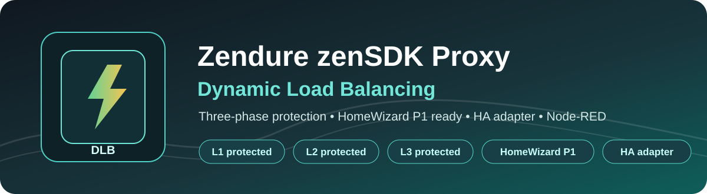
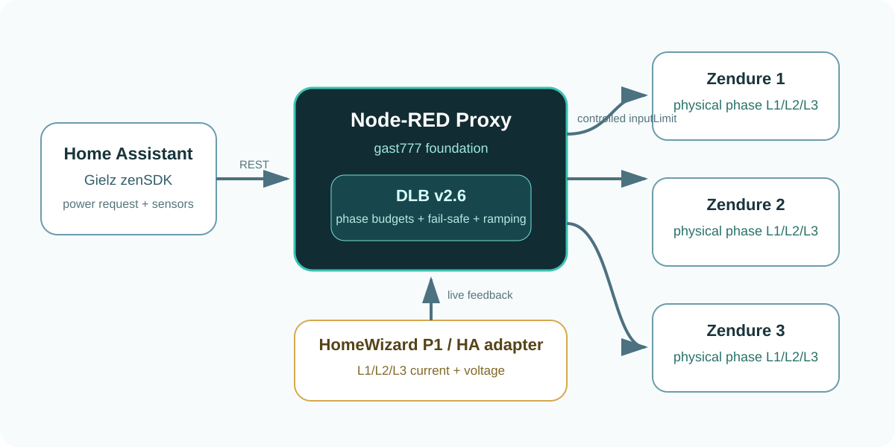
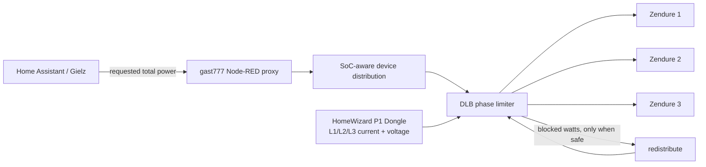
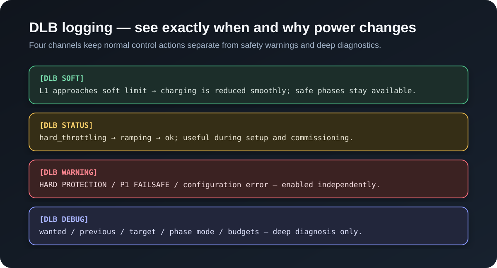

<p align="center">
  
</p>

<p align="center">
  <a href="https://github.com/gast777/Zendure-zenSDK-proxy"></a>
  <a href="https://github.com/Gielz1986/Zendure-HA-zenSDK"></a>
  
  
  
</p>

# Zendure zenSDK Proxy — Dynamic Load Balancing extension

This repository preserves our **three-phase Dynamic Load Balancing (DLB)** development on top of **[gast777/Zendure-zenSDK-proxy](https://github.com/gast777/Zendure-zenSDK-proxy)** for use with **[Gielz1986/Zendure-HA-zenSDK](https://github.com/Gielz1986/Zendure-HA-zenSDK)**.

The upstream gast777 proxy solves the multi-device problem: Home Assistant/Gielz talks to one Node-RED proxy while the proxy controls up to three Zendure devices as one logical battery system and performs SoC-aware power distribution. This project leaves that design in place and adds a protective control layer around **AC charging** so each physical grid phase stays inside its configured current budget.

> **Credit:** the proxy foundation, API behavior, multi-Zendure abstraction and SoC distribution are gast777's work. DLB is a modification layered on top. See [UPSTREAM.md](UPSTREAM.md), [MODIFICATIONS.md](MODIFICATIONS.md) and the upstream-derived [LICENSE](LICENSE).

<p align="center">
  
</p>

## What DLB adds

The design goal is: **follow the charge request from Gielz/gast777 as closely as possible, but never assume that a physical phase has more charging headroom than the P1 measurement allows.**

- Protection for L1, L2 and L3 independently.
- Physical phase mapping independent of Zendure device number.
- One shared safe budget when multiple Zendures are connected to the same phase.
- Safe redistribution of blocked watts to other phase groups with real spare capacity.
- Live P1-triggered corrections during steady requests such as fast charging.
- Per-phase voltage input for W ↔ A conversion with conservative fallback voltage.
- Soft current limit plus hard/emergency limit.
- Controlled soft ramp-down and delayed stepped ramp-up.
- Startup/deploy preflight: unrestricted charging waits for fresh P1 data after Node-RED starts.
- Stale/missing P1 fail-safe instead of assuming missing measurements are safe.
- Four independently selectable DLB log channels.

DLB changes **Zendure AC charging `inputLimit` only**. The upstream discharge logic remains unchanged.

## Default P1 setup: HomeWizard P1 Dongle

The base flow was developed and tested around a **HomeWizard Wi-Fi P1 Meter / P1 Dongle in Home Assistant** and is preconfigured for:

```text
sensor.p1_meter_current_phase_1
sensor.p1_meter_current_phase_2
sensor.p1_meter_current_phase_3
sensor.p1_meter_voltage_phase_1
sensor.p1_meter_voltage_phase_2
sensor.p1_meter_voltage_phase_3
```

### If you use the HomeWizard P1 Dongle

If those six entities exist in Home Assistant, **do not install an adapter and do not edit the six DLB P1 nodes**. The supplied flow is ready for that P1 interface out of the box.

### If you use anything other than the normal HomeWizard P1 Dongle interface

Do **not** follow adapter instructions on this main page. Go to the separate compatibility guide:

➡️ **[Using DLB with another P1 / three-phase meter](docs/OTHER-P1-METERS.md)**

That page contains the optional Home Assistant adapter, installation steps, the v1.1 `last_reported` fix and compatibility checks. Keeping this separate avoids adding unnecessary complexity for HomeWizard users.

## Current release for HomeWizard P1 Dongle

```text
code/integrated/current/20260801-NL-DLB-v2.6.json
```

This remains the standard base build for the HomeWizard P1 Dongle path.

The separate non-HomeWizard compatibility guide uses `v2.6.1 + adapter v1.1` to solve the adapter `last_reported` issue without changing the normal HomeWizard installation. See [Using DLB with another P1 / three-phase meter](docs/OTHER-P1-METERS.md).

## How the control path works



## DLB logging

One of the original goals of the DLB work was that Node-RED should make it obvious **when DLB intervenes, why it intervenes, and how recovery/ramping proceeds**. The original proposal and test examples were shared with gast777 in [issue #18](https://github.com/gast777/Zendure-zenSDK-proxy/issues/18).

v2.6 split this into four independent switches:

```javascript
let dynamic_load_balancing_log_soft_info = 1
let dynamic_load_balancing_log_status_info = 0
let dynamic_load_balancing_log_warnings = 1
let dynamic_load_balancing_log_debug = 0
```

| Switch | What it shows |
|---|---|
| `dynamic_load_balancing_log_soft_info` | Normal soft throttling, recovery/ramping and safe redistribution |
| `dynamic_load_balancing_log_status_info` | Initialization, preflight and DLB state transitions |
| `dynamic_load_balancing_log_warnings` | Hard protection, P1 fail-safe and invalid configuration |
| `dynamic_load_balancing_log_debug` | Detailed wanted/previous/target values and phase calculations |

The recommended daily profile is **soft info ON, warnings ON, status/debug OFF**. This keeps meaningful DLB actions visible while avoiding a continuous diagnostic log stream.

<p align="center">
  
</p>

Example:

```text
[DLB SOFT] active; request=6600W; P1=22.80/8.20/7.90A; budget=350/2400/2400W; applied=350/2400/2400W; Soft phase protection above 23.0A

[DLB WARNING] HARD PROTECTION: request=7200W; P1=25.40/9.10/8.80A; budget=0/2400/2400W; applied=0/2400/2400W; Hard phase protection at 25.0A

[DLB STATUS] hard_throttling → ramping; request=6600W; P1=17.10/8.30/8.00A; budget=2400/2400/2400W; applied=250/2400/2400W; Ramp-up waiting for consecutive phase headroom
```

See **[DLB logging](docs/DLB-logging.md)** for settings profiles and more examples.

## Origin of this extension

The initial three-phase DLB implementation was shared in [gast777/Zendure-zenSDK-proxy issue #18](https://github.com/gast777/Zendure-zenSDK-proxy/issues/18) on 29 June 2026. The proposal described a proxy-only solution that left Gielz untouched, used HomeWizard P1 by default, included communication/P1 fail-safes, exposed configurable current/ramping parameters, and logged DLB actions so throttling and recovery could be followed in Node-RED.

This repository preserves the later development from that starting point: flexible phase mapping, two-device/non-consecutive phase layouts, shared phase budgets, live P1 control, startup preflight, soft/hard limits, ramping, redistribution and categorized logging.

This is still a modified community development line; it should not be presented as an official gast777 release unless the upstream project explicitly adopts it.

---

# Installation

The base proxy installation below is adapted from gast777's upstream README. For authoritative upstream instructions and current proxy-specific details, also read **[gast777/Zendure-zenSDK-proxy](https://github.com/gast777/Zendure-zenSDK-proxy)**.

## 1. Requirements

- Home Assistant with the Gielz ZenSDK setup.
- Node-RED installed and running.
- 1–3 compatible Zendure devices supported by the gast777 proxy line.
- Fixed/stable IP addresses for Zendures and Node-RED.
- Strong/reliable local network connectivity to the Zendures.
- **HomeWizard P1 Dongle with the six standard phase current/voltage entities above.** If you use another meter, first use the [separate compatibility guide](docs/OTHER-P1-METERS.md).
- A backup/export of your currently working Node-RED flow.

## 2. Import the current Node-RED flow

Import:

```text
code/integrated/current/20260801-NL-DLB-v2.6.json
```

Use Node-RED **Menu → Import**, then review the settings before deploying.

## 3. Configure Zendure IP addresses

Open the main configuration node:

```text
===> Vul hier de Zendure IP adressen in <===
```

Enter the real fixed IP address for each installed Zendure. Leave unused device slots empty.

## 4. Configure each Zendure's real physical phase

Set:

```javascript
let zendure_1_phase = "L1"
let zendure_2_phase = "L2"
let zendure_3_phase = "L3"
```

to match the **actual electrical wiring**. Device number and phase number do not have to match. Multiple Zendures may share one phase; they then share one safe phase budget.

## 5. Review the DLB settings

At minimum check:

```javascript
let dynamic_load_balancing_enable = 1
let dynamic_load_balancing_redistribution_enable = 1

let dynamic_load_balancing_max_phase_current_amp = 25
let dynamic_load_balancing_soft_limit_amp = 23.0
let dynamic_load_balancing_failsafe_amp = 6

let dynamic_load_balancing_voltage_fallback = 215
let dynamic_load_balancing_p1_max_age_sec = 15

let dynamic_load_balancing_ramp_up_wait_sec = 20
let dynamic_load_balancing_ramp_up_step_w = 250
let dynamic_load_balancing_ramp_up_step_interval_sec = 10
let dynamic_load_balancing_soft_ramp_down_step_w = 500
```

These are development defaults, not a substitute for choosing limits appropriate for your electrical installation.

## 6. Deploy and verify HomeWizard P1 input

After deployment, verify Node-RED receives fresh L1/L2/L3 current values. Startup preflight deliberately holds charging until fresh current data has arrived after start/deploy.

## 7. Point Gielz/Home Assistant to the proxy

Following gast777's upstream setup, configure the Zendure address in the Gielz dashboard to the Node-RED proxy, for example:

```text
192.168.x.x:1880/endpoint
```

Set Gielz's maximum charge/discharge power to the desired combined capability of the installed Zendure system (for example 4800 W for two identical 2400 W units or 7200 W for three), using the actual limits of your devices.

### Node-RED installed as a Home Assistant App

Gast777's current upstream instructions require:

1. Disable Node-RED App `ssl`.
2. Enable **Show unused optional configuration options**.
3. Enable `leave_front_door_open`.
4. Save and restart Node-RED.
5. In the Gielz dashboard use:

```text
localhost:1880/endpoint
```

See the upstream README for the latest app-specific instructions.

## 8. Commission DLB deliberately

Start at modest charging power and verify:

1. Normal SoC-aware power distribution still works.
2. Adding a load to one phase reduces charging on that phase.
3. Other phases continue only within their measured spare capacity.
4. Removing the load results in delayed/stepped restoration rather than an instant jump.
5. Making P1 current stale/unavailable activates the configured fail-safe.
6. Redeploying Node-RED triggers startup preflight again.

Watch the **actual P1 phase currents** during commissioning.

## More documentation

- [Detailed installation / commissioning](docs/INSTALLATION.md)
- [DLB architecture](docs/DLB-architecture.md)
- [DLB logging](docs/DLB-logging.md)
- [Other P1 meters / adapter](docs/OTHER-P1-METERS.md) — **only for non-HomeWizard P1 Dongle users**
- [Recovered development history](docs/CHANGELOG.md)
- [Upstream relationship](UPSTREAM.md)
- [Modifications relative to gast777](MODIFICATIONS.md)

## Repository layout

```text
code/
├── integrated/
│   ├── current/      # recommended integrated DLB build
│   └── archive/      # recovered historical development builds
├── adapters/         # ONLY for non-HomeWizard P1 sources
└── standalone-experimental/

docs/
├── INSTALLATION.md
├── DLB-architecture.md
├── DLB-logging.md
├── OTHER-P1-METERS.md
└── CHANGELOG.md
```

## License / upstream attribution

The integrated flow is derived from gast777's work and is distributed under the upstream non-commercial terms included in [LICENSE](LICENSE). Modified versions must retain the required attribution/license conditions. See [LICENSE-NOTICE.md](LICENSE-NOTICE.md) and [MODIFICATIONS.md](MODIFICATIONS.md).
